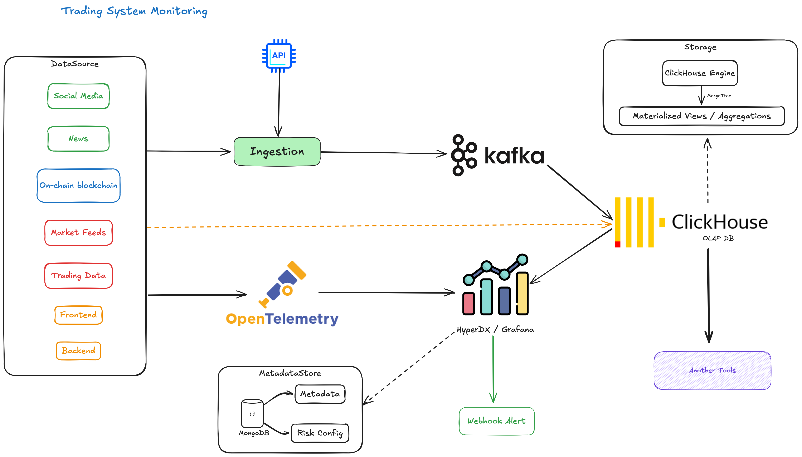

# ✅ Trading System Monitoring

Real-time trading system monitoring platform featuring Kafka-based data pipelines, ClickHouse analytics, OpenAI-powered sentiment analysis, and integrated alerting/observability with HyperDX and Grafana. Supports social, market, and user event ingestion, scalable stream processing, and robust operational best practices.

## 

## Project Structure

```
.
├── .env.example                # Example environment variables
├── DEPLOY.md                   # Deployment guide
├── LOCAL.md                    # HyperDX Local usage
├── HYPERDX_README.md           # HyperDX overview
├── docker-compose-*.yml        # Docker Compose files for various services
├── docker/                     # Docker build contexts and configs
│   ├── clickhouse/             # ClickHouse configs and init scripts
│   ├── hostmetrics/            # Host metrics collector Dockerfile/config
│   ├── hyperdx/                # HyperDX Dockerfile and entry scripts
│   ├── nginx/                  # Nginx reverse proxy config
│   └── otel-collector/         # Otel Collector Dockerfile/config
├── collect-data/               # Data collection tool (Binance → ClickHouse)
│   ├── index.ts
│   ├── package.json
│   └── tsconfig.json
├── smoke-tests/otel-collector/ # OpenTelemetry Collector smoke tests
│   ├── *.bats                  # Bats test files
│   ├── data/                   # Test data and queries
│   ├── test_helpers/           # Bash test helpers
│   ├── docker-compose.yaml     # Test environment
│   └── receiver-config.yaml    # Otel Collector config for tests
└── .volumes/                   # Docker volumes (data, logs, etc.)
```

---

### Processing & Analytics checklists:

- [x] Prepare server for ClickHouse (single node).
- [x] Setup docker ClickHouse (server). Kafka (broker). Connectors (Clickhouse Engine Kafka Connect / custom producers). HyperDX / Grafana self-host for visualization.
- [x] Design **orderbook ticks** table (depth snapshot / delta).
- [x] Design **user orders** table (API order events).
- [x] Design **user trades** table (executed trades).
- [x] Design **user withdraws** table.
- [x] Design **user action / browser actions** table.
- [x] Design **social sentiment / news buzz** table.
- [x] Apply **TTL 30 days** to all fact tables.
- [x] Optimize schema with `LowCardinality`, `Enum`, `CODEC(ZSTD, Delta)`.
- [ ] Write **producers** to push data from:
  - [ ] Matching engine → Kafka → ClickHouse.
  - [ ] Trading Action (orders, deposit, withdraws) → Kafka → ClickHouse.
  - [ ] Browser frontend (user actions) → Kafka → ClickHouse.
  - [ ] Social/news crawler → OpenAI sentiment → Kafka → ClickHouse.
- [ ] Create **Kafka Engine tables** for each topic.
- [ ] Create **Materialized Views** to insert into MergeTree tables.
- [ ] Create queries/MVs to compute **daily risk profile per user**, **pre-aggregated tables** to avoid heavy fact ↔ fact joins.
- [ ] Connect ClickHouse → HyperDX / Grafana to build dashboards: User risk score, Token risk score, System Warning alerts.
- [ ] Create scheduled queries (cron / materialized view) → output to **alert table**.
- [ ] Small service reads alert table → send **webhook/Slack/Telegram**.
- [ ] Example alert rules:
  - [ ] User logs in from new IP + large withdrawal within <1h.
  - [ ] Negative buzz volume increases >200% in 30m for a token.
  - [ ] Suspicious trading activity (wash trading / self-matching).
- [ ] Add **on-chain blockchain data** (etherscan, solana explorer, etc.).
- [ ] Build **Feature Store** for ML-based risk models.
- [ ] Integrate **real-time stream processing** if advanced logic required.

---

## Prerequisites

- [Docker](https://www.docker.com/)
- [Docker Compose](https://docs.docker.com/compose/)
- (For development) [Node.js](https://nodejs.org/) and [Yarn](https://yarnpkg.com/)
- (For smoke tests) [Bats](https://github.com/bats-core/bats-core), [ClickHouse client](https://clickhouse.com/docs/en/integrations/sql-clients/clickhouse-client), `curl`

---

## Running with Docker Compose

To spin up the full stack (ClickHouse, MongoDB, HyperDX, Otel Collector):

Using Malefile:

- Start all docker and script collect data: `make start`
- Start only script collect data: `make demo`

```sh
docker compose -f docker-compose-clickhouse.yml up -d
docker compose -f docker-compose-kafka.yml up -d
docker compose -f docker-compose-mongodb.yml up -d
docker compose -f docker-compose-hyperhx.yml up -d
# OR using Grafana
docker compose -f docker-compose-grafana.yml up -d
```

- The UI will be available at [http://localhost:8126](http://localhost:8126) (or as configured).
- The API will be available at [http://localhost:8125](http://localhost:8125).
- OpenTelemetry endpoints: `http://localhost:4318` (HTTP), `localhost:4317` (gRPC).

To stop and remove containers:

```sh
docker compose -f docker-compose-hyperhx.yml down
docker compose -f docker-compose-kafka.yml down
docker compose -f docker-compose-mongodb.yml down
docker compose -f docker-compose-clickhouse.yml down
docker compose -f docker-compose-grafana.yml down
```

---

## Data Collection

The [`collect-data`](collect-data/index.ts) tool streams Binance miniTicker data into ClickHouse.

To run it (requires Node.js):

```sh
cd collect-data
yarn install
yarn dev
```

Configure ClickHouse connection via environment variables if needed (`CLICKHOUSE_HOST`, `CLICKHOUSE_USER`, etc).

---

## Smoke Tests

Smoke tests for the OpenTelemetry Collector are in [`smoke-tests/otel-collector`](smoke-tests/otel-collector/README.md):

```sh
cd smoke-tests/otel-collector
bats *.bats
```

See the [README](smoke-tests/otel-collector/README.md) in that directory for details.

---

## Environment Variables

Copy `.env.example` to `.env` and adjust as needed for your environment.

---

## Useful Links

- [DEPLOY.md](DEPLOY.md) — Deployment instructions
- [LOCAL.md](LOCAL.md) — HyperDX Local usage
- [HYPERDX_README.md](HYPERDX_README.md) — HyperDX overview

---

## License

MIT
